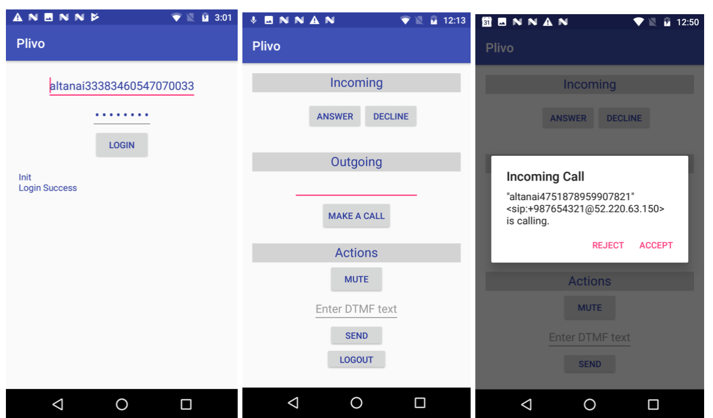

# Plivo Android Sample App for Voice Calling



The Plivo Android SDK v2 allows you to make outgoing and receive incoming calls in your Android application.

## Pre-requisites

1. [Plivo Account](https://manage.plivo.com/accounts/register/)

2. [Create an endpoint with a username and a password.](https://manage.plivo.com/endpoint/create/)


## Get started
	
Plivo Android SDK interacts with the Plivo API and XML to control calls on the server side. 
This gives your Android app access to all available features of the Plivo voice API such as conferencing or recording. 
Plivo Android SDK can also work seamlessly with other endpoints: landline (PSTN), IP or SIP phones and devices, and web applications. All calls that interface with your mobile apps will be transported over SIP.

1. Launch the application from Android Studio.
2. Enter the username and password of your endpoint when prompted for.
	
## Voice Calling App 

### 1. Initiate Plivo Endpoint

```aidl
import com.plivo.endpoint.Endpoint;
public Endpoint endpoint;

endpoint = new Endpoint(true, this);
```
The first argument is debug and second is event listener reference

### 2. Register your your SDK to Plivo. 
This is the first step to make and receive calls from the Android SDK.
```aidl
endpoint.login(usernameStr, passwordStr);

```

### 3. Make outbound calls from your app using the Android SDK.
```aidl
import com.plivo.endpoint.Outgoing;

// Define a varaible of type Outgoing
public Outgoing outgoing;

//Instnatiate outgoing varaible
outgoing = new Outgoing(endpoint);

Map<String, String> extraHeaders = new HashMap<>();
extraHeaders.put("X-Header1", "value1");
extraHeaders.put("X-Header2", "value2");
outgoing.callH(phoneNumberText.getText().toString(),extraHeaders);

```

### 4. Receive inbound calls on your app using the Android SDK.
```aidl
import com.plivo.endpoint.Outgoing;

// Define a varaible of type Incoming
public Incoming incoming;

//Instantiate incoming varaible
incoming = Phone.getInstance(this).incoming;

incoming.answer()
```


Reference link: [Android SDK Documentation](https://www.plivo.com/docs/sdk/android/)

##### License

MIT
